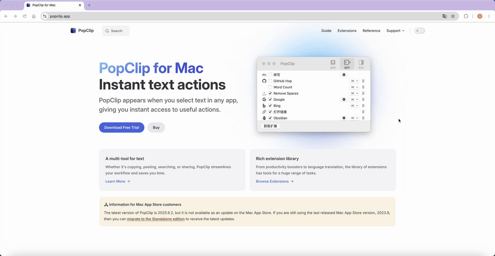

# GitHub Hop

[中文](./README.zh-CN.md) | English



Select any text → instantly jump to its GitHub repo homepage.

## Features

- **`owner/repo`** (e.g. `facebook/react`) → instant jump, zero latency
- **Project name** (e.g. `lodash`) → GitHub Search API `in:name` query; auto-jumps only if exactly 1 repo has this exact name, otherwise opens search page
- **Author name** (e.g. `@ajanlab`) → auto-strip `@`, search GitHub
- **Fallback** → API failure / rate limit / timeout → gracefully degrades to GitHub search

## Installation

1. Download the latest `github-hop.popclipextz` from the [Releases page](https://github.com/ajanlab/github-hop-popclip/releases)
2. Double-click to install into PopClip
3. Select any text → click the GitHub icon in PopClip's toolbar

System requirements: macOS 10.15+, PopClip 2023+, python3 (Xcode CLT or Homebrew)

### Build from Source

```bash
cd github-hop.popclipext/
# Edit Config.yaml or Source/github-hop.sh
cd ..
zip -r github-hop.popclipextz github-hop.popclipext/
# Double-click the resulting .popclipextz to install
```

## How It Works

```
Selected text → clean (strip quotes/@) → owner/repo? ─yes→ direct jump (0ms)
                                           └no→ API in:name query (5s timeout)
                                                 ├─ 1 exact name match → repo page
                                                 ├─ 0 or 2+ matches → search page
                                                 └─ failure/limit → search page
```

## Privacy

- **Only to GitHub API** — sends selected text exclusively to GitHub's public search API. No third-party servers, no analytics, no tracking.
- **No analytics** — no telemetry, no third-party endpoints
- **No storage** — no cache files, no logs, no state
- **No permissions needed** — no API keys, no login, no network authorization (handled by PopClip)
- **Minimal dependencies** — bash, curl, open (macOS built-in) + python3 (Xcode CLT or Homebrew)

## Verification

Test from the command line (no PopClip needed):

```bash
# 1. Test owner/repo direct jump (zero latency)
export POPCLIP_TEXT="facebook/react"
./github-hop.popclipext/Source/github-hop.sh
# Expected: opens https://github.com/facebook/react directly

# 2. Test project name API resolution
export POPCLIP_TEXT="lodash"
./github-hop.popclipext/Source/github-hop.sh
# Expected: API resolves to https://github.com/lodash/lodash (only if unique name;
# if multiple repos named "lodash", opens search page instead)

# 3. Test @username handling
export POPCLIP_TEXT="@ajanlab"
./github-hop.popclipext/Source/github-hop.sh
# Expected: strips @, searches "ajanlab"

# 4. Test nonexistent project (fallback)
export POPCLIP_TEXT="this-project-does-not-exist-12345"
./github-hop.popclipext/Source/github-hop.sh
# Expected: API returns no results (or ambiguous), opens GitHub search page

# 5. Test empty input
export POPCLIP_TEXT=""
./github-hop.popclipext/Source/github-hop.sh
# Expected: exit code 1, no browser action

# 6. Run automated test suite
chmod +x test.sh && ./test.sh
```

## Environment Variables

| Variable | Source | Description |
|---|---|---|
| `POPCLIP_TEXT` | PopClip | Selected text (required) |

No API keys required. Zero configuration.

## License

MIT License — free to use, modify, and distribute.
